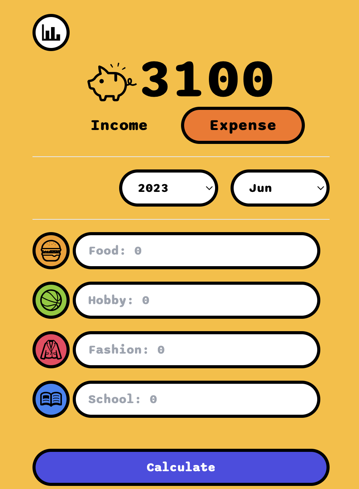

# Kids Allowance Book
Status: WIP
## About
_A simple application that could help you to keep how much money your kids have spent and how much left in their "digital" savings, etc. It is just like a small digital biggy bank._

_The target users would be kids and their parents._


---

### __TECH STACK__
**Front-end**
* React.js
* TypeScript
* Axios
* Chart.js
* TailwindCss
* Vite
* Vitest + Tesing Library (WIP)

**Backend**
* Node.js (Express.js)

**Database**
* SQLite (sqlite3)

### __How to run the app locally__
#### 1) Install dependencies
````bash
npm install
````

#### 2) Run both frontend and backend
```bash
npm run start
```

